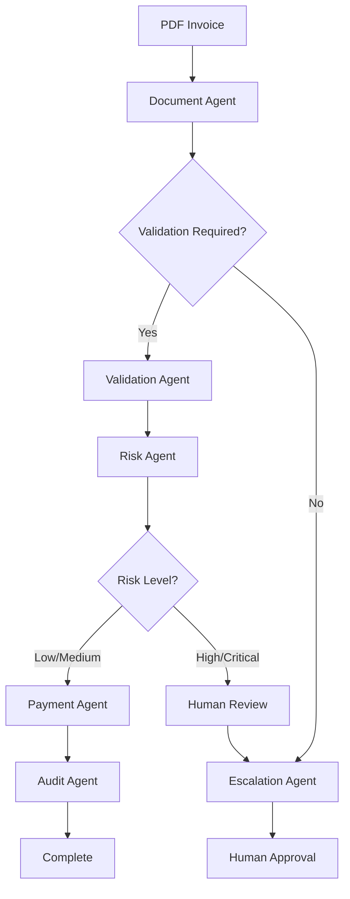

# 🤖 Invoice AgenticAI - LangGraph

An advanced AI-powered invoice processing system built with **LangGraph** for intelligent agentic workflows. This system automates the entire invoice processing pipeline from document extraction to payment processing using multiple specialized AI agents.

## 🌟 Features

### 🔄 **Agentic Workflow Architecture**
- **Multi-Agent System**: 6 specialized AI agents working collaboratively
- **LangGraph Orchestration**: Intelligent workflow routing and state management
- **Dynamic Decision Making**: Conditional routing based on validation results and risk scores
- **Human-in-the-Loop**: Seamless escalation for complex cases

### 🤖 **AI-Powered Agents**

1. **📄 Document Agent**
   - PDF text extraction using multiple methods (PyMuPDF, PDFPlumber)
   - AI-powered invoice parsing with Gemini 2.0 Flash
   - Confidence scoring and data validation

2. **✅ Validation Agent**
   - Purchase order matching with fuzzy logic
   - Discrepancy detection and analysis
   - Three-way matching validation

3. **🛡️ Risk Agent**
   - AI-powered fraud detection
   - Compliance checking against business rules
   - Risk scoring and recommendation generation

4. **💳 Payment Agent**
   - Intelligent payment routing and method selection
   - Integration with payment APIs
   - Retry logic and error handling

5. **📋 Audit Agent**
   - Comprehensive audit trail generation
   - Compliance reporting (SOX, GDPR, etc.)
   - Regulatory documentation

6. **⚠️ Escalation Agent**
   - Human-in-the-loop workflow management
   - Approval hierarchy routing
   - SLA monitoring and notifications

### 🎯 **Key Capabilities**
- **Intelligent Document Processing**: Extract structured data from complex invoices
- **Automated Validation**: Cross-reference with purchase orders and detect discrepancies
- **Risk Assessment**: AI-powered fraud detection and compliance checking
- **Smart Payment Decisions**: Automated payment processing with intelligent routing
- **Comprehensive Auditing**: Full compliance tracking and regulatory reporting
- **Escalation Management**: Seamless human review for edge cases

## 🏗️ **Architecture**



## 🚀 **Quick Start**

### Prerequisites
- Python 3.8+
- Google AI Studio API keys (Gemini)
- Git

### 1. Clone the Repository
```bash
git clone https://github.com/Amruth22/Invoice-AgenticAI-LangGraph.git
cd Invoice-AgenticAI-LangGraph
```

### 2. Install Dependencies
```bash
pip install -r requirements.txt
```

### 3. Environment Setup
```bash
# Copy environment template
cp .env.example .env

# Edit .env file with your API keys
nano .env
```

Add your Gemini API keys:
```env
GEMINI_API_KEY_1=your_gemini_api_key_here
GEMINI_API_KEY_2=your_gemini_api_key_here
GEMINI_API_KEY_3=your_gemini_api_key_here
GEMINI_API_KEY_4=your_gemini_api_key_here
```

### 4. Create Required Directories
```bash
mkdir -p data/invoices logs output/audit output/escalations
```

### 5. Start Payment API (Terminal 1)
```bash
python payment_api.py
```

### 6. Run the Application (Terminal 2)
```bash
streamlit run main.py
```

### 7. Access the Application
Open your browser and navigate to: `http://localhost:8501`

## 📁 **Project Structure**

```
Invoice-AgenticAI-LangGraph/
├── agents/                     # AI Agent implementations
│   ├── base_agent.py          # Base agent class
│   ├── document_agent.py      # PDF processing & AI parsing
│   ├── validation_agent.py    # PO matching & validation
│   ├── risk_agent.py          # Risk assessment & fraud detection
│   ├── payment_agent.py       # Payment processing
│   ├── audit_agent.py         # Compliance & audit trails
│   └── escalation_agent.py    # Human-in-the-loop workflows
├── graph/                      # LangGraph workflow
│   ├── state_models.py        # State management & data models
│   └── invoice_graph.py       # Workflow orchestration
├── utils/                      # Utilities
│   └── logger.py              # Centralized logging
├── data/                       # Data files
│   ├── invoices/              # PDF invoices (add your files here)
│   └── purchase_orders.csv    # PO reference data
├── output/                     # Generated outputs
│   ├── audit/                 # Audit records
│   └── escalations/           # Escalation records
├── main.py                     # Streamlit application
├── payment_api.py             # Payment simulation service
└── requirements.txt           # Dependencies
```

## 🎮 **Usage Guide**

### Processing Invoices

1. **Upload Invoice PDFs**
   - Place PDF invoices in the `data/invoices/` directory
   - The system supports various invoice formats

2. **Select Workflow Type**
   - **Standard**: Normal processing workflow
   - **High Value**: Enhanced validation for large amounts
   - **Expedited**: Fast-track processing for urgent invoices

3. **Configure Processing**
   - Set priority level (1-5)
   - Choose max concurrent processing
   - Select invoices to process

4. **Monitor Progress**
   - Real-time processing status
   - Agent performance metrics
   - Escalation alerts

### Dashboard Features

#### 📊 **Overview Tab**
- Processing status distribution
- Timeline visualization
- Success/failure metrics

#### 📋 **Invoice Details Tab**
- Detailed invoice information
- Processing results
- Audit trail for each invoice

#### 🔍 **Agent Performance Tab**
- Agent execution metrics
- Success rates and duration
- Performance analytics

#### ⚠️ **Escalations Tab**
- Issues requiring human attention
- Escalation reasons and details
- Approval workflow status

#### 📈 **Analytics Tab**
- Risk vs amount analysis
- Processing efficiency metrics
- Business intelligence insights

## 🔧 **Configuration**

### Agent Configuration
Each agent can be configured in `main.py`:

```python
config = {
    "document_agent": {
        "extraction_methods": ["pymupdf", "pdfplumber"],
        "ai_confidence_threshold": 0.7
    },
    "validation_agent": {
        "fuzzy_threshold": 80,
        "amount_tolerance": 0.05
    },
    "risk_agent": {
        "risk_thresholds": {
            "low": 0.3, "medium": 0.6, "high": 0.8, "critical": 0.9
        }
    }
}
```

### Workflow Types
Customize workflow behavior in `graph/state_models.py`:

```python
WORKFLOW_CONFIGS = {
    "standard": WorkflowConfig(...),
    "high_value": WorkflowConfig(...),
    "expedited": WorkflowConfig(...)
}
```

## 🧪 **Testing**

### Health Check
```bash
# Check system health
curl http://localhost:8501/health

# Check payment API
curl http://localhost:8000/health
```

### Sample Data
The repository includes sample purchase orders and can process various invoice formats.

## 🔒 **Security & Compliance**

### Data Protection
- PII handling with retention policies
- Secure API key management
- Audit trail encryption

### Compliance Standards
- SOX (Sarbanes-Oxley) compliance
- GDPR data privacy
- Financial controls validation
- Comprehensive audit trails

### Access Control
- Role-based approval hierarchy
- Escalation workflows
- Human review requirements

## 📊 **Monitoring & Analytics**

### Real-time Metrics
- Processing success rates
- Agent performance
- Risk distribution
- Processing times

### Audit & Reporting
- Comprehensive audit trails
- Compliance reports
- Escalation tracking
- Performance analytics

## 🚀 **Advanced Features**

### Parallel Processing
- Concurrent invoice processing
- Configurable concurrency limits
- Load balancing across agents

### Error Handling
- Automatic retry mechanisms
- Graceful failure handling
- Escalation on repeated failures

### Extensibility
- Plugin architecture for new agents
- Custom workflow definitions
- Configurable business rules

## 🤝 **Contributing**

1. Fork the repository
2. Create a feature branch
3. Make your changes
4. Add tests if applicable
5. Submit a pull request

## 📝 **License**

This project is licensed under the MIT License - see the LICENSE file for details.

## 🆘 **Support**

For issues and questions:
1. Check the documentation
2. Search existing issues
3. Create a new issue with detailed information

## 🔮 **Roadmap**

- [ ] Database integration for persistence
- [ ] Advanced ML models for better accuracy
- [ ] Integration with more payment gateways
- [ ] Mobile application
- [ ] Advanced analytics dashboard
- [ ] Multi-language support

---

**Built with ❤️ using LangGraph, Streamlit, and Google Gemini AI**